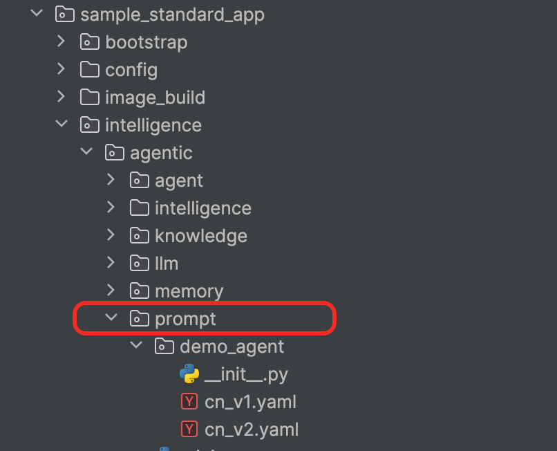
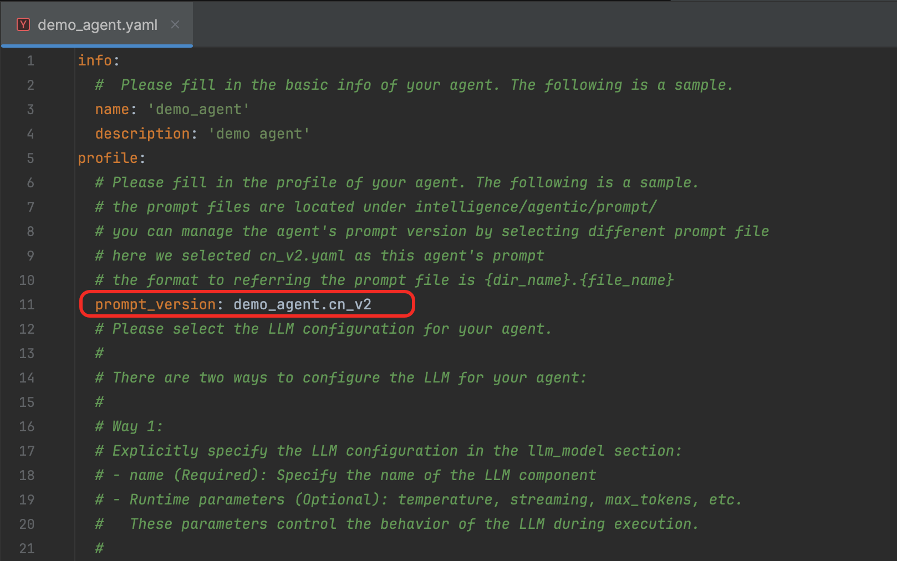

# Documentation Description  
In this example, we will further introduce how to use the prompt management module.

# Using the Prompt Management Module  
Demo Path: [sample_standard_app](../../../../examples/sample_standard_app)

In the process of building multi-agent applications, we often encounter scenarios where a single agent has multiple versions of prompts (such as multi-language support or adapting a single agent to different llm instances). If prompts are configured in each agent's YAML configuration file, it significantly increases the difficulty for users to manage prompts.

We recommend that you manage prompts in the form of YAML files, unified in the `xxx/intelligence/agentic/prompt` directory (`xxx` represents the project name and directory). For example, see the [prompt directory location](../../../../examples/sample_standard_app/intelligence/agentic/prompt) in the sample project.

Use the agent name as the subdirectory name (e.g., `demo_agent`). Within this subdirectory, store all prompt versions for the current agent (e.g., `cn_v1` and `cn_v2`). The agentUniverse prompt management module will assign a unique `prompt_version` to each prompt file for management and usage. The `prompt_version` is composed of the **subdirectory name + prompt file name** (e.g., `demo_agent.cn_v1` and `demo_agent.cn_v2`).
Taking the `demo_agent.yaml` in the `sample_standard_app` project as an example, we can see in the configuration that the `prompt_version` is set to `demo_agent.cn_v2`, which corresponds to the actual prompt file [cn_v2.yaml](../../../../examples/sample_standard_app/intelligence/agentic/prompt/demo_agent/cn_v2.yaml).

By doing so, we can manage and use a large number of prompts in an orderly and flexible manner by simply modifying the `prompt_version` in the agent YAML file.