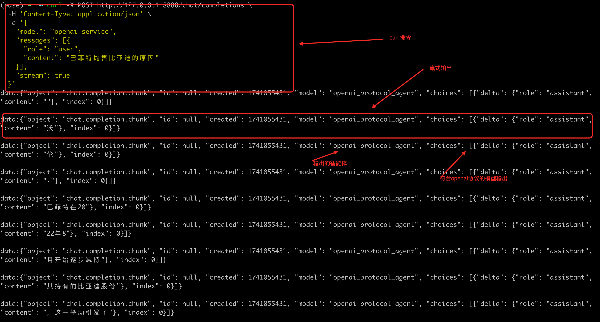
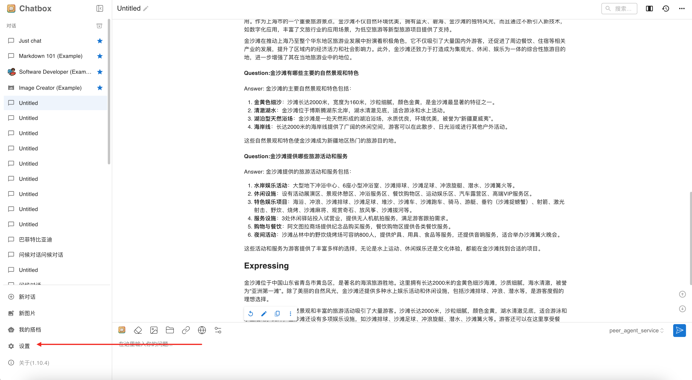
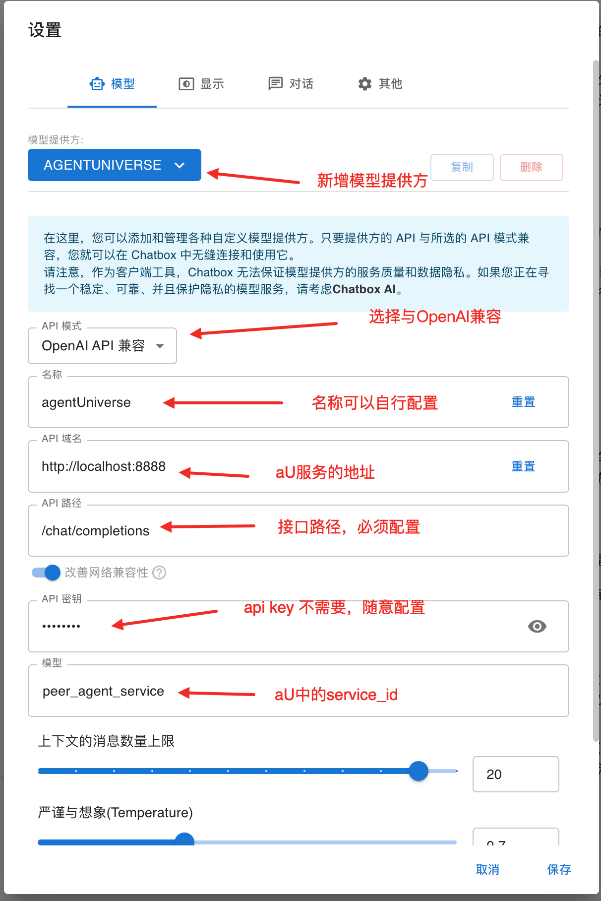

# Guide to Connecting agentUniverse via Chatbox/CherryStudio

This document guides developers on how to quickly connect to the agentUniverse intelligent service compliant with OpenAI protocols using ChatBox or CherryStudio tools.

## I. Environment Preparation

### 1. Install Client Tools
Install one of the following tools:
* ChatBox  
  [Download Link](https://chatboxai.app/zh#download)
* CherryStudio  
  [Download Link](https://cherry-ai.com/download)

### 2. Prepare agentUniverse Project
Refer to the aU [Quick Start](https://github.com/antgroup/agentUniverse/blob/master/README_zh.md) documentation to create an agentUniverse project and successfully launch the `demo_agent` sample application.

## II. Create OpenAI Protocol-Compliant Agent

### 1. Define Agent Logic
Create `openai_protocol_agent.py` under the project path `intelligence/agentic/agent/agent_template/`:

```python
from agentuniverse.agent.input_object import InputObject
from agentuniverse.agent.template.openai_protocol_template import OpenAIProtocolTemplate

class DemoOpenAIProtocolAgent(OpenAIProtocolTemplate):
    def input_keys(self) -> list[str]:
        return ['input']

    def output_keys(self) -> list[str]:
        return ['output']

    def parse_input(self, input_object: InputObject, agent_input: dict) -> dict:
        agent_input['input'] = input_object.get_data('input')
        return agent_input

    def parse_result(self, agent_result: dict) -> dict:
        return {**agent_result, 'output': agent_result['output']}
```
**Note**: To ensure the agent's output complies with the OpenAI protocol, it must inherit from the `OpenAIProtocolTemplate` class.

### 2. Configure Agent Instance
Create `openai_protocol_agent.yaml` in the `intelligence/agentic/agent/agent_instance/` directory:

```yaml
info:
  # Basic agent info (sample below)
  name: 'openai_protocol_agent'
  description: 'demo agent'
profile:
  # Agent profile (sample below)
  prompt_version: demo_agent.cn
  # LLM configuration
  llm_model:
    # Replace with your customized LLM if needed
    # e.g., 'demo_llm' defined in /intelligence/agentic/llm/demo_llm.yaml
    name: 'qwen_25_72b_llm'
action:
  # Tools and knowledge base
  tool:
    # Using a mock_search_tool for demonstration
    # Replace with a real search tool (e.g., demo_search_tool) and configure API keys in /config/custom_key.toml
    - 'mock_search_tool'
  knowledge:
    # Advanced features (refer to documentation)
memory:
  name: 'demo_memory'
metadata:
  type: AGENT
  class: DemoOpenAIProtocolAgent
```

### 3. Create Service Interface
Create `openai_agent_service.yaml` in the `intelligence/service/agent_service/` directory:

```yaml
name: 'openai_service'
description: 'demo service of demo agent'
agent: 'openai_protocol_agent'
metadata:
  type: 'SERVICE'
```

### 4. Start agentUniverse Service
Launch the agentUniverse service using `bootstrap/intelligence/server_application.py`. After successful startup, test the service with the following cURL command:

```shell
curl -X POST http://127.0.0.1:8888/chat/completions \
  -H 'Content-Type: application/json' \
  -d '{
    "model": "openai_service",
    "messages": [{
      "role": "user",
      "content": "巴菲特抛售比亚迪的原因"
    }],
    "stream": true
  }'
```
Response example:  


## III. Configure Client Tools

1. Launch Chatbox and open a chat window. The main interface:  
  
2. Click the settings button to configure:  
  
  * Key configurations:
    * **API Domain**: `http://127.0.0.1:8888`
    * **API Path**: `/chat/completions`
    * **Model**: `openai_service` (your agent service name)
    * **API Key**: Any placeholder value
    * **Name**: Customizable
3. Save settings.

## IV. Testing

- Enter any message in Chatbox and click send to view the agent's response:  
  