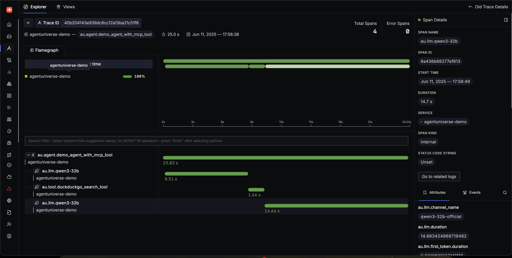
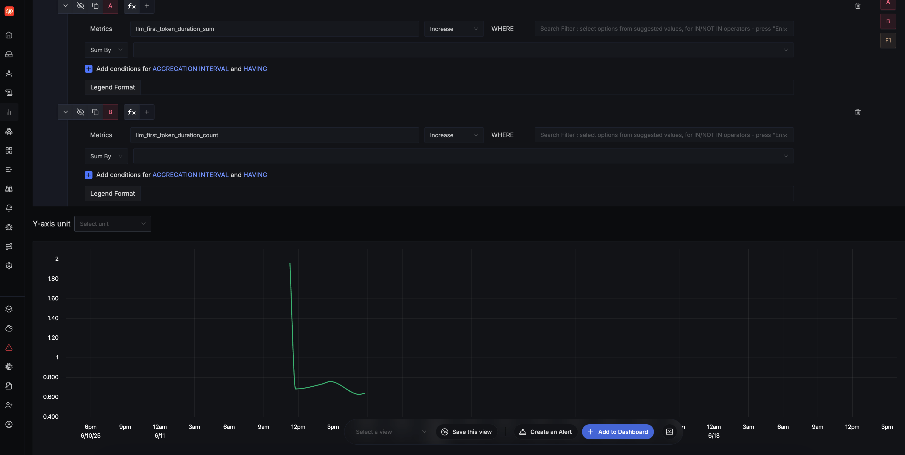

# Observability with OpenTelemetry

This document introduces the observability capabilities based on OpenTelemetry in the agentUniverse project, including the core management class TelemetryManager and the OTel extension components unique to agentUniverse.

## Overview

In agentUniverse, we implement distributed tracing (Trace) and metrics collection using TelemetryManager, which is built upon OpenTelemetry. Users can customize the OTel-related configurations through the configuration file `config.toml`. Additionally, agentUniverse provides LLM-, Tool-, and Agent-level instrumentation, enabling users to trace the full lifecycle of agents.

## Core Components

### 1. TelemetryManager

[Code Link](../../../../../../agentuniverse/base/tracing/otel/telemetry_manager.py)

The main management class responsible for initializing and configuring the entire OpenTelemetry setup. It reads related configurations from `config.toml`, and initializes Tracer and Metrics providers. It supports custom Resource definitions, Provider classes, and allows users to add various SpanProcessors, Metric Readers, and Instrumentations. For detailed configuration methods and recommended settings, please refer to [Recommended Configuration](Recommended_Configurations.md).

### 2.Instruments

agentUniverse offers three types of Instrumentation based on LLMs, Tools, and Agents. You can enable them according to your needs by [Recommended Configuration](Recommended_Configurations.md). Detailed span attributes and metric types are documented in each Instrument’s dedicated page:

- [LLM_Instrument](./Instrument_LLM.md)
- [Tool_Instrument](./Instrument_Tool.md)
- [Agent_Instrument](./Instrument_Agent.md)


### 3. SessionSpanProcessor

[Code Link](../../../../../../agentuniverse/base/tracing/otel/span_processor/session_span_processor.py)

A custom span processor that injects session ID information into each Span. It is automatically registered once OTel is enabled; no additional configuration is needed.

#### Features

- Automatically adds a session ID attribute named `au.trace.session.id` at span start time.
- If no session ID exists, it defaults to `-1`

### 4. AUSessionPropagator

[Code Link](../../../../../../agentuniverse/base/tracing/otel/span_processor/session_span_processor.py)

A custom context propagator used to propagate session information across services. It is automatically registered when OTel is enabled, requiring no extra configuration.

#### Features

- Propagates the session ID within Baggage under the keys `AU-SessionId` and `auSessionId` (both have the same value) between upstream and downstream applications.

## Example

In real-world deployments, you can use different exporters to send Trace and Metric data to various observability platforms such as Jaeger, Prometheus, etc., allowing visualization of this data. This section demonstrates how to observe agents locally using Signoz.

Signoz is an open-source observability platform supporting unified analysis of metrics, logs, and traces. Built on top of OpenTelemetry, it supports self-hosting and is ideal for developers monitoring microservices. 

Official website: https://signoz.io。

### 1. Deploy Signoz Locally
Deploying Signoz locally is straightforward. Use the official deployment script:
```shell
git clone https://github.com/SigNoz/signoz.git
cd signoz/deploy/
chmod +x install.sh
./install.sh
```

### 2. Configure OTel in agentUniverse Application
Configure the application as follows to send Trace and Metric data to Signoz using `OTLPSpanExporter` and `OTLPMetricExporter` over HTTP:
```toml
[OTEL]
service_name = "agentuniverse-demo"

# Optional custom provider configuration (uses default TracerProvider if omitted)
provider_class = "opentelemetry.sdk.trace.TracerProvider"
id_generator_class = "opentelemetry.sdk.trace.RandomIdGenerator"

# List of instrumentation modules
instrumentations = [
  # AgentUniverse instrumentation
  "agentuniverse.base.tracing.otel.instrumentation.llm.llm_instrumentor.LLMInstrumentor",
  "agentuniverse.base.tracing.otel.instrumentation.agent.agent_instrumentor.AgentInstrumentor",
  "agentuniverse.base.tracing.otel.instrumentation.tool.tool_instrumentor.ToolInstrumentor",
]

# Resource metadata to identify the service
[OTEL.resource]
deployment = "development"
version = "1.0.0"
environment = "dev"

# Processor configuration - Batch spans and export by OTLP HTTP
[[OTEL.processors]]
class = "opentelemetry.sdk.trace.export.BatchSpanProcessor"

  # Console exporter配置
  [OTEL.processors.exporter]
  class = "opentelemetry.exporter.otlp.proto.http.trace_exporter.OTLPSpanExporter"

    [OTEL.processors.exporter.args]
    endpoint = "http://localhost:4318/v1/traces"

[[OTEL.metric_readers]]
class = "opentelemetry.sdk.metrics.export.PeriodicExportingMetricReader"

  [OTEL.metric_readers.args]
  export_interval_millis = 1000

  # ── Metric Exporter
  [OTEL.metric_readers.exporter]
  class = "opentelemetry.exporter.otlp.proto.http.metric_exporter.OTLPMetricExporter"

    [OTEL.metric_readers.exporter.args]
    endpoint = "http://localhost:4318/v1/metrics"
```

### 3. Run the Agent Service

You can now run any agent service, and telemetry data will be exported accordingly.

### 4. View the Results

The local web UI of Signoz is accessible by default at http://localhost:8080.

#### Trace


#### Metrics


