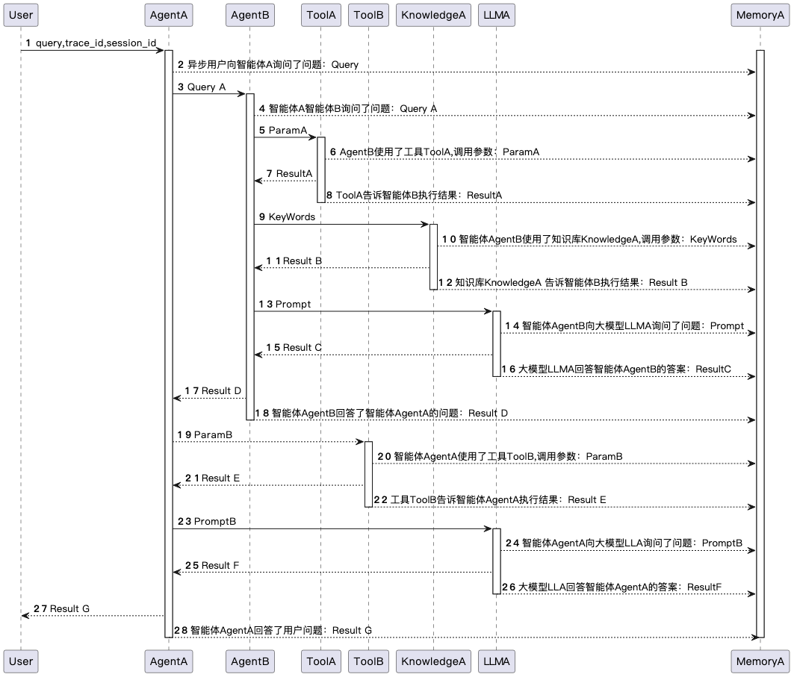
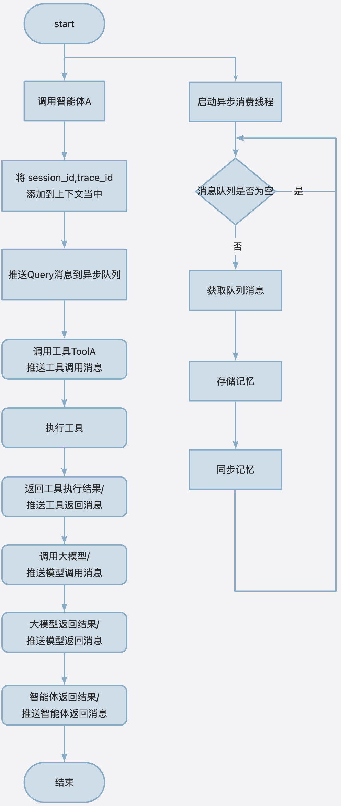

# 记忆概念说明

## 单个智能体的记忆

单个智能体的记忆是指该智能体在与用户、其他智能体、工具以及知识库交互过程中所记录的内容。这些交互内容包括以下要素：

- **消息类型 (`type`)**: 指消息是输入(`input`)还是输出(`output`)，即该消息对当前智能体而言是询问还是回答。
- **消息发起方 (`source`)**: 标识消息是由哪个实体发出的，可以是用户(`user`)、智能体(`agent_name`)或工具(`tool`)
  。例如，当用户向智能体提出问题时，`source`为`user`且`type`为`input`；而当智能体作出回应时，`source`为智能体，`type`为
  `output`。
- **消息接收方 (`target`)**: 指明消息的接收者，可能是用户(`user`)、智能体(`agent_name`)或工具(`tool`)。这与消息的流向相关联，例如，用户的问题将
  `target`设为智能体，而智能体的回答则将`target`设为用户。
- **发起方类型 (`source_type`)**: 描述发起方的种类，如智能体(`agent`)、工具(`tool`)、用户(`user`)、语言模型(`llm`)或知识库(
  `knowledge`)。
- **接收方类型 (`target_type`)**: 表示接收方的类别，选项同`source_type`。
- **消息内容 (`content`)**: 使用自然语言描述的消息主体，比如：
    - 用户向智能体`demo_rag_agent`提问：“巴菲特退出比亚迪的原因是什么？”
    - `demo_rag_agent`回答了用户的问题：“巴菲特退出比亚迪的原因是xxxxxx。”

通过`source`与`target`属性标记消息的流向，并利用`source_type`与`target_type`来指定流向的类型。

## 记忆的主要关联方

记忆中的交互涉及以下几个主要关联方：

- **用户 (`user`)**: 发起请求或接收响应的人类用户。
- **工具 (`tool`)**: 可能被智能体使用以辅助完成任务的应用程序或设备。
- **知识库 (`knowledge`)**: 提供信息或数据的存储库，如数据库、文本文件、网页等。

## 记忆的主要操作

新增、检索、删除、压缩、裁剪

## 全局记忆

在多智能体系统中，记忆不仅记录单个智能体的交互信息，还按时间顺序和`trace_id`
记录所有参与智能体的工作流程。这使得可以从整体协作的角度追溯每个智能体的行为，并还原出单个智能体的记忆。

### 多智能体交互记录要素

- **会话标识 (`conversation_id`)**: 用于标识消息属于哪个会话，适用于跨越多个轮次的长对话。
- **追踪标识 (`trace_id`)**: 用于记录当前轮次的信息，确保可以跟踪每一轮次中的具体交互。

通过上述要素，特别是`conversation_id`和`trace_id`，可以精确地记录和重现多智能体间的交互过程，以及各智能体内部的状态变化。

### 全局记忆到智能体记忆同步机制

同步过程是全局记忆管理的一个关键部分，它确保了智能体能够及时获得最新的相关信息。当全局记忆更新时，系统会识别出哪些变化与特定智能体相关，并将这些变化同步到智能体的本地记忆库中。这一过程是自动化的，旨在最小化延迟并最大化智能体间的协作效率。

## 记忆的主要关联方

记忆中的交互涉及以下几个主要关联方：

- **用户 (`user`)**: 发起请求或接收响应的人类用户。
- **智能体 (`agent`)**: 参与交互处理并响应其他实体的实体。
- **工具 (`tool`)**: 可能被智能体使用以辅助完成任务的应用程序或设备。
- **知识 (`knowledge`)**: 智能体可以访问的知识资源，可能用于增强决策或提供信息。

## 全局记忆的数据结构

为了记录和管理多智能体系统中的交互，我们定义了全局记忆的数据结构，用于捕捉每次交互的关键细节。以下是该数据结构中每个字段的具体说明：

| 名称                | 类型     | 说明                                                                                          |
|-------------------|--------|---------------------------------------------------------------------------------------------|
| `id`              | string | 唯一标识符，确保每条记录在全局记忆库中是独一无二的。                                                                  |
| `conversation_id` | string | 标识消息所属的会话，适用于跨越多个轮次的长对话。                                                                    |
| `trace_id`        | string | 在一次交互过程中，所有相关工具、智能体、知识库调用的消息拥有相同的`trace_id`，以便于追踪单轮次内的所有活动。                                 |
| `source`          | string | 交互的发起方，可以是用户(`user`)、智能体(`agent`)或工具(`tool`)等。                                              |
| `source_type`     | string | 发起方的类型，进一步明确`source`的具体类别，如智能体(`agent`)、工具(`tool`)、用户(`user`)、语言模型(`llm`)或知识库(`knowledge`)。 |
| `target`          | string | 消息的接收方，与`source`相对，表示消息的目标实体。                                                               |
| `target_type`     | string | 接收方的类型，与`source_type`类似，但针对的是接收方。                                                           |
| `content`         | string | 消息的内容，使用自然语言表达，例如用户的提问或智能体的回答。                                                              |
| `type`            | string | 消息的类型，分为输入(`input`)和输出(`output`)，即询问还是回答。                                                   |
| `timestamp`       | string | 消息的时间戳，采用标准时间格式记录消息发生的时间，有助于按时间顺序组织记忆。                                                      |

### 数据结构的作用

通过上述字段，`conversation memory`
能够全面记录每一次交互的详细信息，包括但不限于交互双方的身份、交互内容以及交互发生的背景（如会话ID和时间）。这些记录不仅支持全局记忆库的维护，还为后续的分析、检索和同步操作提供了坚实的基础。

# 详细能力设计

## 记忆采集的流程

### 记忆采集的时序过程

### 全局记忆采集流程

# 记忆采集流程

为了确保多智能体系统中的交互能够被高效、准确地记录下来，我们设计了一套记忆采集流程。该流程通过异步线程、阻塞队列和切面配置来实现自动化记忆管理。以下是详细的步骤说明：

### 1. 异步线程启动与队列初始化

- **服务启动后**：当多智能体系统启动时，会创建一个独立的异步线程。
- **阻塞消费队列**：该线程负责监控并从队列中消费消息，采用阻塞模式等待新消息的到来。

### 2. 检测线程环境变量并推送信息到队列

- **调用工具、智能体或大模型之前/之后**：在每次调用这些组件前或接收其结果后，系统会检查当前交互智能体的配置，判断当前交互是否需要存储。

### 3. 阻塞队列消费与存储

- **消费消息**：异步线程持续从队列中消费消息，处理每个条目。
- **存储到memory**：将处理后的调用信息存储到全局记忆库（`memory`）中，确保所有交互都被准确记录。

### 4. 标准aU组件的切面配置

- **配置切面**：所有标准的aU组件（例如智能体、工具、知识库）都预先配置了切面（AOP, Aspect-Oriented Programming），用于拦截特定方法的执行。
- **记忆采集操作**：在切面中，系统会根据用户是否启用了全局记忆功能来决定是否执行记忆采集操作。如果启用，则按照前述流程进行记忆记录；否则，跳过记忆采集步骤。

