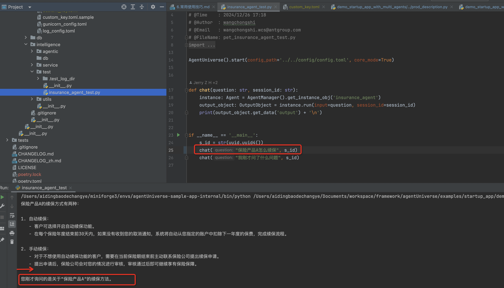

# 文档说明
在本例中我们将进一步向大家介绍如何在智能体中加入记忆模块。

# 在智能体中加入记忆模块
在智能体使用过程中，我们需要使用智能体记忆这一能力，我们在样例工程中建立了一个使用记忆的案例。

样例地址：[demo_startup_app_with_single_agent_and_memory](../../../../examples/startup_app/demo_startup_app_with_single_agent_and_memory)

在AU智能体中记忆的使用同样通过配置挂载即可，我们可以参考智能体[insurance_agent](../../../../examples/startup_app/demo_startup_app_with_single_agent_and_memory/intelligence/agentic/agent/agent_instance/insurance_agent.yaml)配置中`memory`部分。

在该案例中我们配置demo_memory作为记忆实例类型，我们进一步在demo_memory.yaml(路径：agentUniverse/examples/startup_app/demo_startup_app_with_single_agent_and_memory/intelligence/agentic/memory/demo_memory.yaml)中查看该实例的具体配置。

## 测试记忆模块
通过[insurance_agent_test.py](../../../../examples/startup_app/demo_startup_app_with_single_agent_and_memory/intelligence/test/insurance_agent_test.py)测试入口可以看到智能体加入记忆模块后的使用情况。

