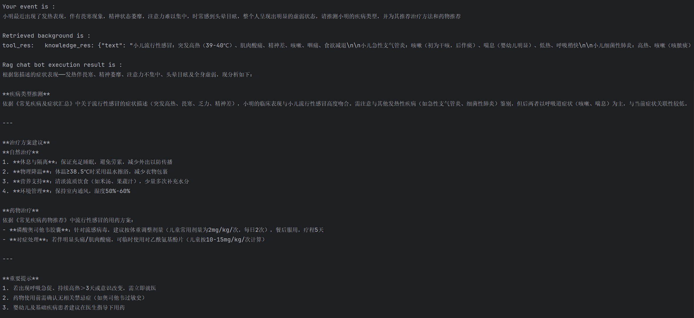
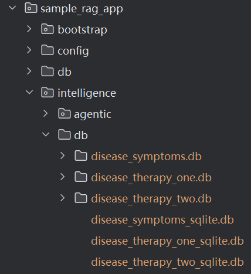

# Disease Helper

This case is based on the RagAgentTemplate and builds a simple medical consultation agent. By retrieving relevant information from Recommendations on Drugs for Common Diseases, Introduction to Natural Therapies for Common Diseases, and Summary of Common Diseases and Symptoms, and combining it with the user's provided descriptions of physical symptoms, the agent can reasonably infer the user's disease type and provide corresponding natural treatment plans and medication treatment plans.

This case is based on the Deepseek large model and the embedding and rerank functions of DashScope. Before use, you need to configure the DASHSCOPE_API_KEY in the environment variables.

## Quick Start
### Configure API Key
For example, configure the key information in the custom_key.toml file (this file is used to manage private key configurations in agentUniverse). The discussion group uses DeepSeek as the default base model and Serper as the Google Search tool; the following sections will explain the usage methods of other models or tools.
```toml
[KEY_LIST]
# serper google search key
SERPER_API_KEY='xxx'
# deepseek api key
DEEPSEEK_API_KEY='xxx'
```
### Build a Disease Knowledge Base
The disease knowledge base is built on the knowledge components in agentUniverse. By storing the symptoms and treatment plans of common diseases in ChromaDB and SQLite, it creates a knowledge base that is convenient for agents to access and retrieve.

Materials on Symptoms and Treatment Plans of Common Diseases:
- Summary of Common Diseases and Symptoms.docx
- Introduction to Natural Therapies for Common Diseases.docx
- Drug Recommendations for Common Diseases.docx

disease_knowledge is defined as follows:
```yaml
name: "disease_knowledge"
description: "常见疾病症状与治疗方法相关的知识库"
stores:
    - "disease_symptoms_chroma_store"
    - "disease_therapy_one_chroma_store"
    - "disease_therapy_two_chroma_store"
    - "disease_symptoms_sqlite_store"
    - "disease_therapy_one_sqlite_store"
    - "disease_therapy_two_sqlite_store"
query_paraphrasers:
    - "custom_query_keyword_extractor"
insert_processors:
    - "recursive_character_text_splitter"
rag_router: "nlu_rag_router"
post_processors:
    - "dashscope_reranker"
readers:
    docx: "default_docx_reader"
metadata:
  type: 'KNOWLEDGE'
  module: 'medical_consultation_assistant_app.intelligence.agentic.knowledge.disease_knowledge'
  class: 'DiseaseKnowledge'
```

### Code Run
In the examples/sample_apps/sample_rag_app example project of agentUniverse, locate the legal_advice_rag_agent.py file under the intelligence/test directory. In the chat method, enter the question you want to be answered, then run it.

For example, enter the question: "Xiao Ming has recently had symptoms of fever, accompanied by chills. He experiences lethargy, difficulty concentrating, frequent dizziness, and overall obvious weakness. Please infer the type of disease Xiao Ming has, and recommend treatment methods and medications for him."
```python
from agentuniverse.agent.output_object import OutputObject
from agentuniverse.agent.agent import Agent
from agentuniverse.agent.agent_manager import AgentManager
from agentuniverse.base.agentuniverse import AgentUniverse

AgentUniverse().start(config_path='../../config/config.toml', core_mode=True)


def chat(question: str):
    instance: Agent = AgentManager().get_instance_obj('disease_rag_agent')
    output_object: OutputObject = instance.run(input=question)

    question = f"\nYour event is :\n"
    question += output_object.get_data('input')
    print(question)

    background_info = f"\nRetrieved background is :\n"
    background_info += output_object.get_data('background').replace("\n","")
    print(background_info)

    res_info = f"\nRag chat bot execution result is :\n"
    res_info += output_object.get_data('output')
    print(res_info)


if name == '__main__':
    chat("小明最近出现了发热表现，伴有畏寒现象，精神状态萎靡，注意力难以集中，时常感到头晕目眩，"
         "整个人呈现出明显的虚弱状态，请推测小明的疾病类型，并为其推荐治疗方法和药物推荐")
```
### Result Demonstration
question: "Xiao Ming has recently had symptoms of fever, accompanied by chills. He experiences lethargy, difficulty concentrating, frequent dizziness, and overall obvious weakness. Please infer the type of disease Xiao Ming has, and recommend treatment methods and medications for him."



## More Details
### Reader Component
- [default_docx_reader](../../../../../agentuniverse/agent/action/knowledge/reader/file/docx_reader.yaml)

### DocProcessor Component
- [custom_query_keyword_extractor](../../../../../examples/sample_apps/rag_app/intelligence/agentic/knowledge/doc_processor/query_keyword_extractor.yaml)
- [recursive_character_text_splitter](../../../../../agentuniverse/agent/action/knowledge/doc_processor/recursive_character_text_splitter.yaml)

### QueryParaphraser Component
- [custom_query_keyword_extractor](../../../../../examples/sample_apps/rag_app/intelligence/agentic/knowledge/query_paraphraser/custom_query_keyword_extractor.yaml)

### RagRouter Component
- [nlu_rag_router](../../../../../examples/sample_apps/rag_app/intelligence/agentic/knowledge/rag_router/nlu_rag_router.yaml)

### Store Component
- [disease_symptoms_chroma_store](../intelligence/agentic/knowledge/store/disease_symptoms_chroma_store.yaml)
- [disease_therapy_one_chroma_store](../intelligence/agentic/knowledge/store/disease_therapy_one_chroma_store.yaml)
- [disease_therapy_two_chroma_store](../intelligence/agentic/knowledge/store/disease_therapy_two_chroma_store.yaml)
- [disease_symptoms_sqlite_store](../intelligence/agentic/knowledge/store/disease_symptoms_sqlite_store.yaml)
- [disease_therapy_one_sqlite_store](../intelligence/agentic/knowledge/store/disease_therapy_one_sqlite_store.yaml)
- [disease_therapy_two_sqlite_store](../intelligence/agentic/knowledge/store/disease_therapy_two_sqlite_store.yaml)

For your convenience, we have stored the database files containing relevant information as shown in the figure below.


If you want to build the knowledge base from scratch, you can run the __init__.py file in the test folder. The code is as follows:
